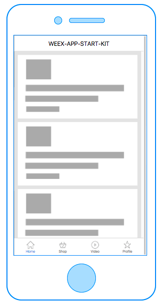

# weex-app-seed

[]()


weex-app-seed是一款用于快速创建weex vue项目的模版。



[Demos](https://weex-plugins.github.io/weex-app-start-kit/weex.html?page=home.js)


### 特性

相对于原始weexpack初始化的项目，它具有下面新的特性:

*   初始化应用的基本布局,这里你可以看到一个更为复杂的weex 应用, 覆盖了搜索，视频，个人信息，动态流等。

*   提供weex 新的API使用参考，应用覆盖了大多数weex的属性，你可以参考实现。

*   提供一些基本定义的组件实现包括，icon，navbar, tabbar等。

*   基于webpack2构建， 使用webpack dev server 支持live reload。

*   集成<a href="https://github.com/weex-plugins/weex-amap">weex-amap</a>插件,可以直接使用地图插件。


### 如何使用

首先确保你安装了weexpack，如过没有安装可以执行:
``` bash
npm install weexpack -g
```
[weexpack文档](https://github.com/weexteam/weex-pack)


``` bash
git clone https://github.com/weex-plugins/weex-app-start-kit.git first_weex_app

cd first_weex_app && npm install  // 进入目录执行完依赖安装
```

这样你的weexpack 创建的项目环境就OK了,你可以执行任何weexpack命令了。

这个时候执行weexpack run web/ios/android 就可以预览你的文件了.


### Thanks

+ [Icons Designed by linea.io](http://linea.io/)

+ [Instagram UI Mockup](https://www.behance.net/gallery/38441555/Free-Mockup-PSD-New-Interface-Instagram-2016)